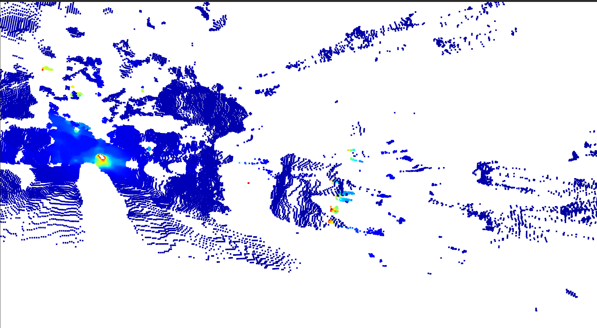

# 3D-reconstruction-from-Stereo-image
May be a library to create a 3D model from a pair of stereo image

## This is not the final output, initial progress will be updating it 

## libraries required:
	1. python3
	2. OpenCV
	3. Open3D

# Initial update: on 3D_reconstruction_V2.py

## Original image(left):

## Disparity

## 3D Reconstruction

